# RepairShoprToShipRush

Azure Function to synchronize RepairShopr paid invoices with ShipRush, continuously pulling invoices from RepairShopr and uploading them to ShipRush.

Created for Louis Rossmann to rid him of PayPal dependence.

## Deployment Steps

### Prerequisits:
- [Azure Subscription](https://azure.microsoft.com/en-us/free/)
- [GitHub Account](https://github.com/join/)

### Azure Subscription:
Because the this task is a continious one, we need some where to host this function. Microsoft Azure provides free Functionsruntime for up to 1,000,000 executions per month. Which is plenty enough for this purpose.

Visit this [link](https://azure.microsoft.com/en-us/free/) to create your Azure Subscription for free. You will need a Microsoft Account (e.g: @outlook.com, @hotmail.com, or @live.com email account)

### GitHub Account
The code for the function is hosted on GitHub (well duh!!). In order for the instance of your code not to be affected by any changes that may happen to this repository in th future, it is advised that you create a fork from this code, and use it to deploy your function.

Visit this [link](https://github.com/join/) to create your GitHub account, it is free. Once you do, come back to this page and press the "Fork" button on the top right corner of the page. This basically allows you to clone a copy of this repository as it currently exists under your account.

So, from now on, everything you do will be on your new forked repository.

### Creating your Azure Function
- Login to the [Azure Portal](https://portal.azure.com) and find the "Create a resource" button on the top left corner. Then sellect the "Internet of Things" category and find the "Function App" link. You can also just search for "Function App" to find it.
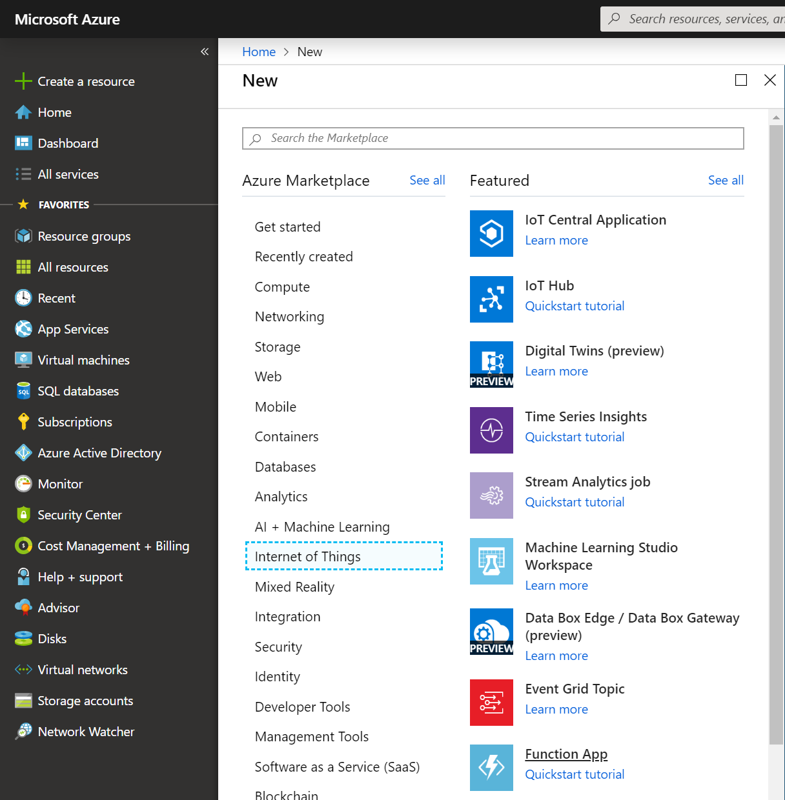
- Fill in the details for the Function App as follows:
  - App Name: The name of the app, which will also be the url for your Function App
  - Subscription: Choose the subscription where this app will be billed against, for our purposes choose the Trial subscription you've created when you signed up
  - Resource Group: Sort of a folder to group related Azure Resources together, everything you create now will reside in the same Resourcr Group
  - OS: Windows or Linux are both fine as this app is cross-platform. However I'd choose Windows because this is the platform where the app was coded and tested
  - Hosting Plan: Consumption plan allows you to simply host your app without needing to concern yourself with a Web Server (in Azure called App Service) to host it. Consumption plans are free for a total of 1,000,000 executions per subscription per month.
  - Location: Choose the Azure region where you want this app to be deployed. I don't know where RepairShopr and ShipRush datacenters are. But hopefully somewhere in the US. So choose any Azure Region located in the US would be fine. This is just for latency purposes, but in theory you can deploy your app anywhere and it would still work
  - Runtime Stack: The app is built using .Net runtime (netcore2.1)
  - Storage: The app needs a Storage Account to store the resulting logs, this wizard will create you a new Storage Account
  - Application Insights: This is an Application Performance Monitoring platform, for the purposes of our small app, this won't be required, just set it to disabled
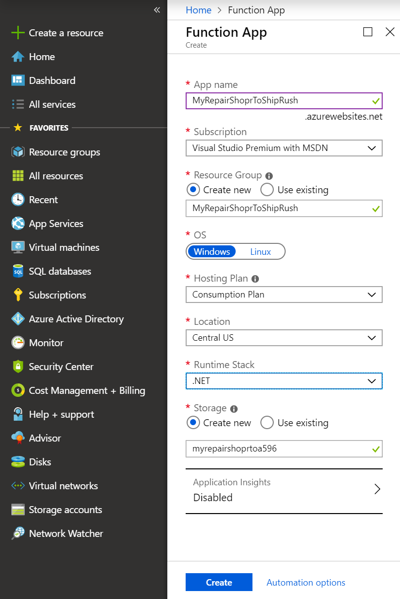
- Once you fill in these details as shown, click Create and give it a minute to be be done. You can the deployment progress on the Notifications area on the top right corner.
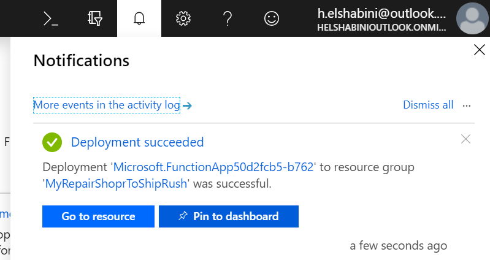
- Once the Function App is deployed, click on "Go to resource" from the Notifications area
- Click the big "New Function" button on the center of the screen
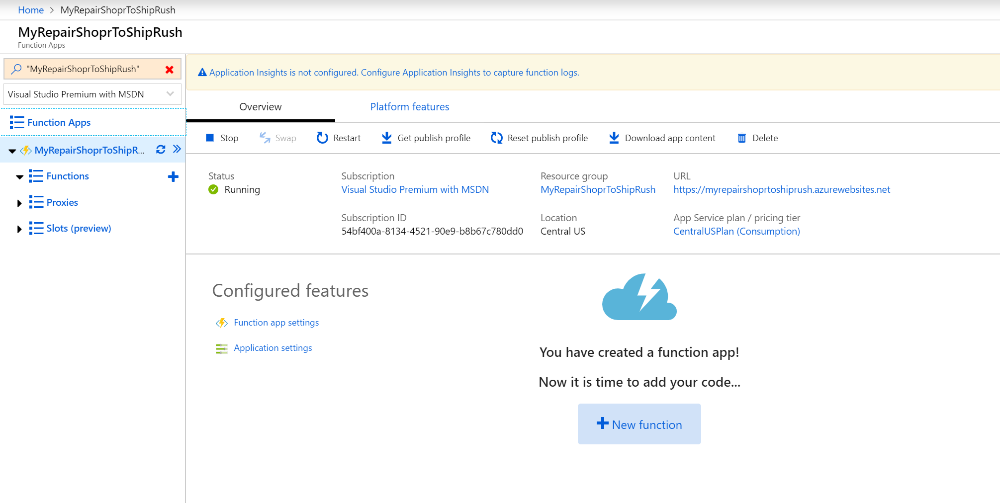
- Choose "Visual Studio" then press "Continue"
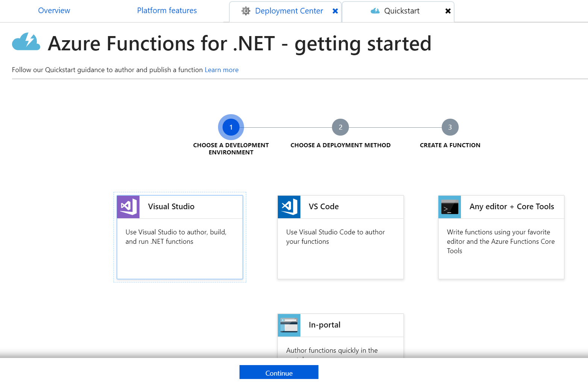
- Choose "Use Deployment Center" then press "Continue"

- Click on "Finish and go to Deployment Center"
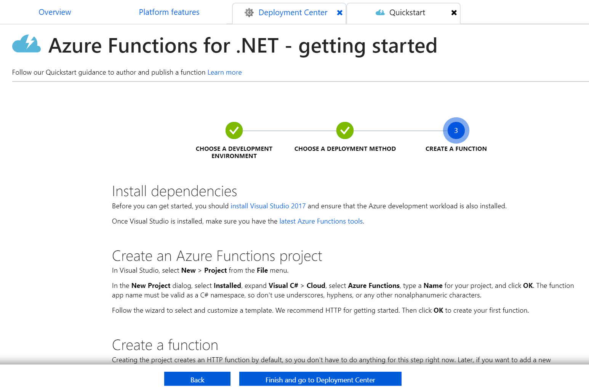
- Choose "GitHub" then press "Continue"
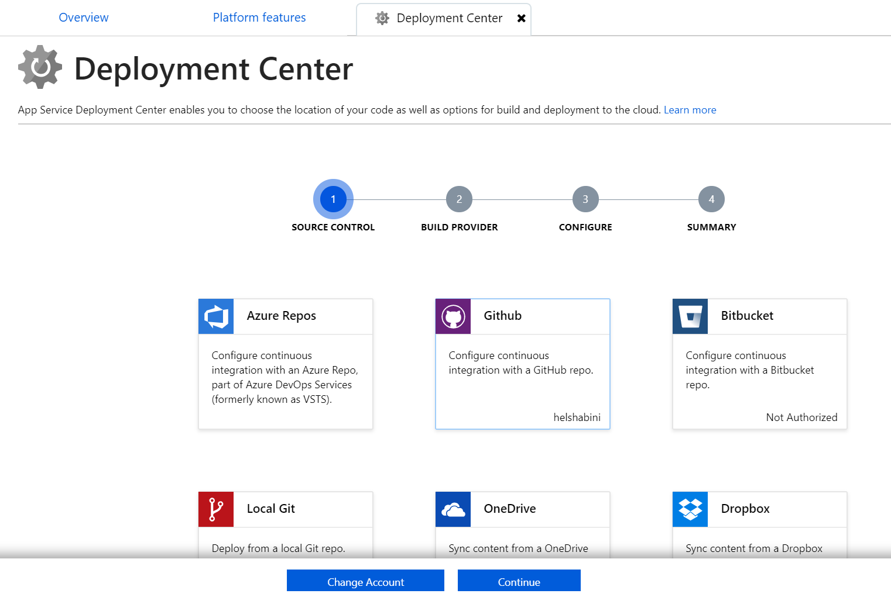
- Choose "App Service build service" then press "Continue", it may then require you to login to GitHub
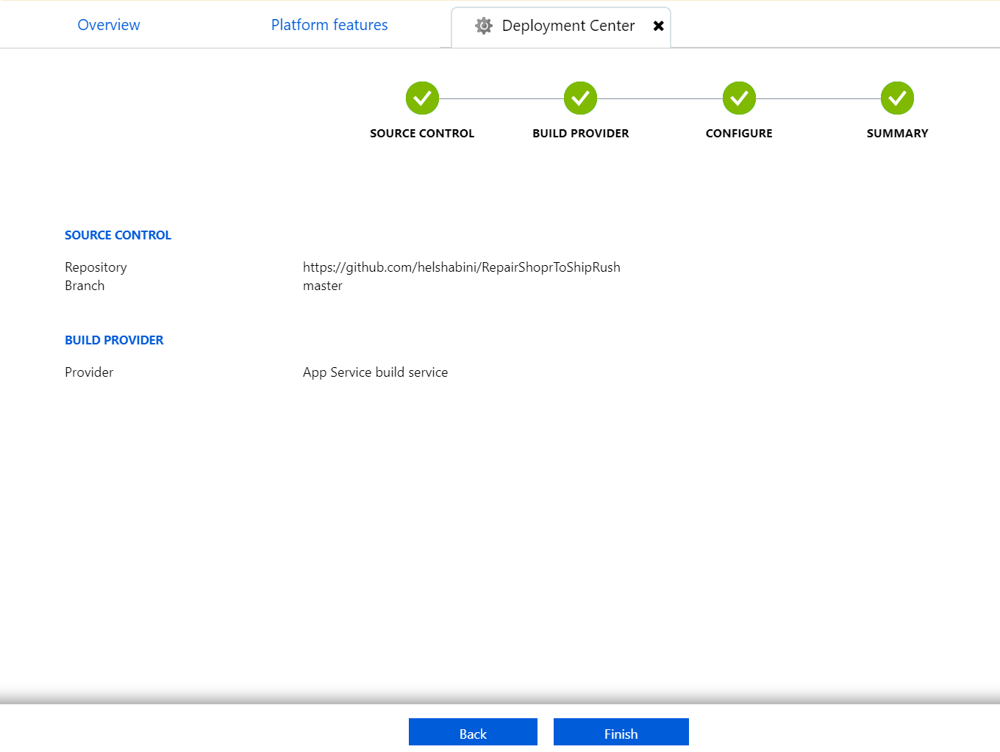
- Enter the details for the repository you forked then press "Continue"

- Click on the "Finish" button, now your app is being deployed from GitHub, to the Function App. Also, any changes to the code on your repository, should automatically reflect to the Function App, which makes code maintainence much easier
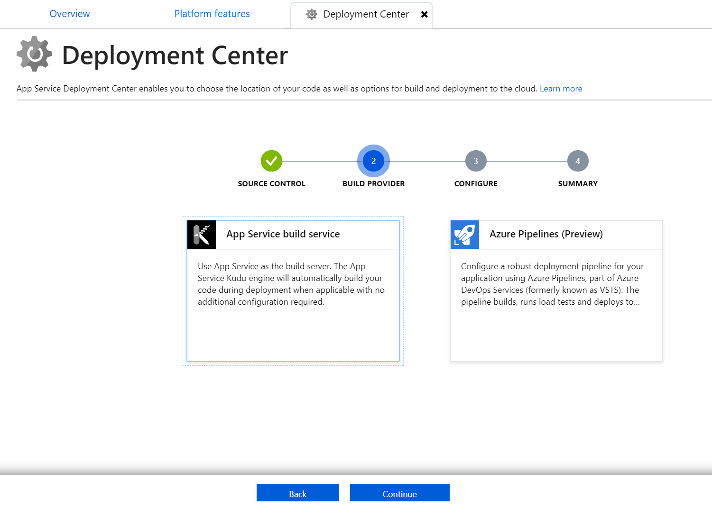
- After the screen shows the deployment is successful, you can move on to the next step
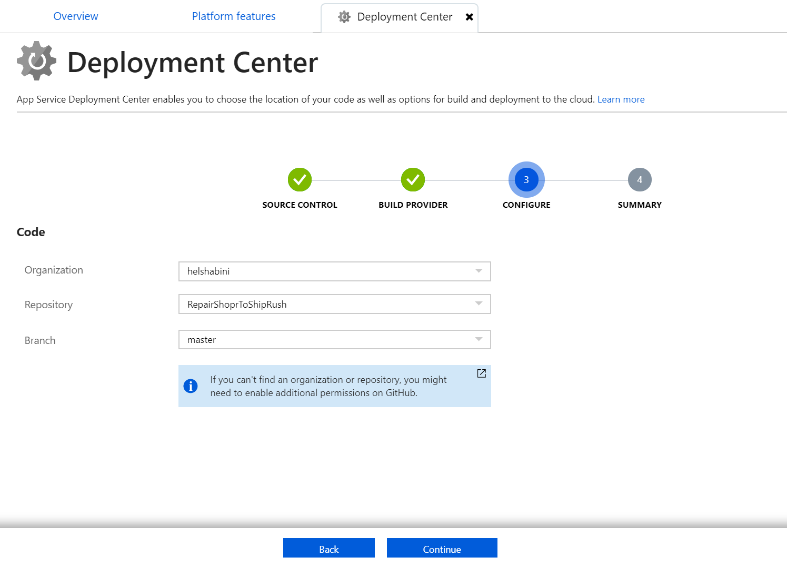

### RepairShopr API Url
- Login to your RepairShopr account
- Note the Url in the browser for you RepairShopr tenant. For example, my url is https://**helshabini**.repairshopr.com 
- To get the API Url, put in your tenant name in this Url: https://**yourtenant**.repairshopr.com/api/vi/invoices
- Keep the API Url handy, we will need it later.

### RepairShopr API Key
- From the account menu in the top right corner, and choose "Profile/Password"
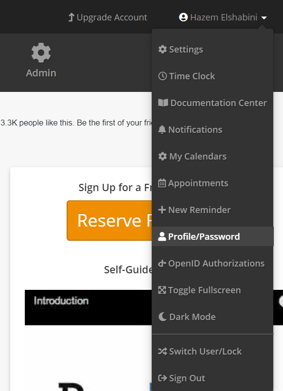
- Copy the API Key from and keep it handy. We will need it later
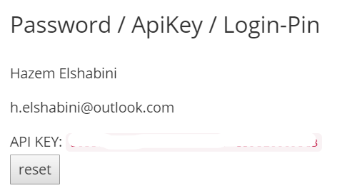

### ShipRush Configuration and API Url and Key
- Login to your ShipRush account
- From the left hand side menu choose "Web Stores"
- Click the "Add Web Store" button from the right hand side
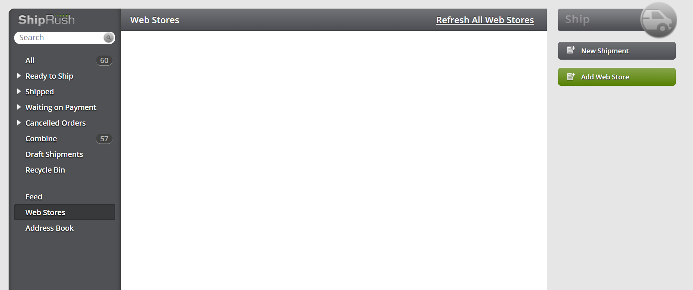
- Choose "Custom Post-In" and click "Next"
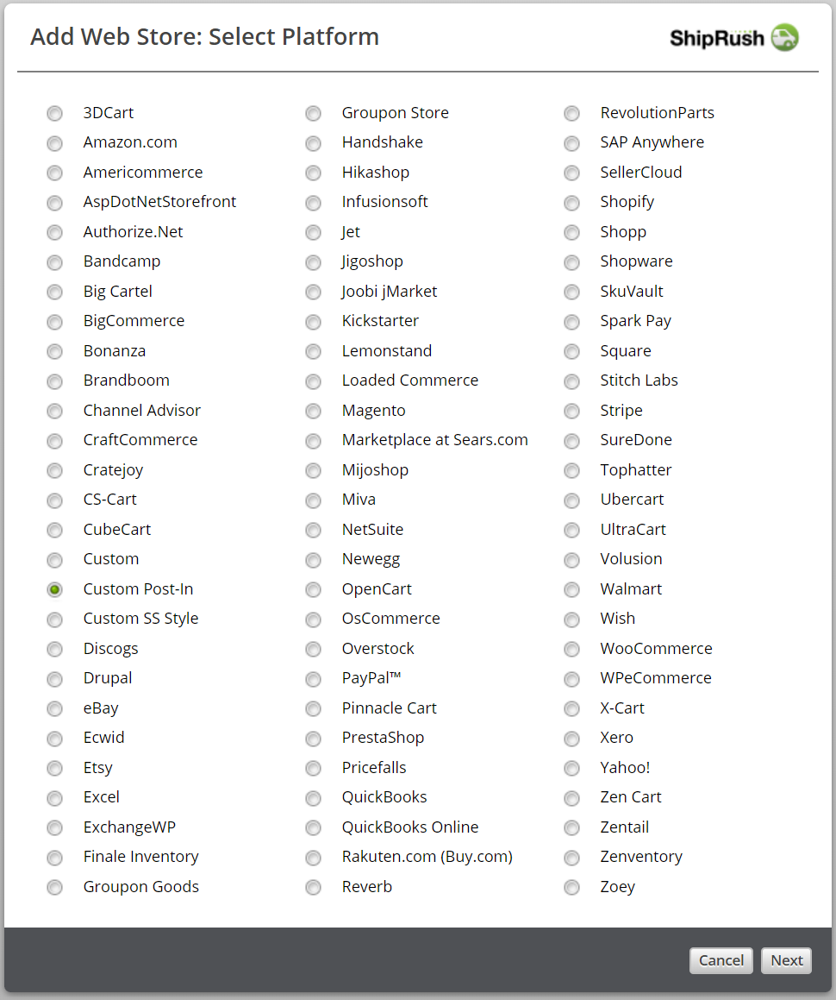
- Copy the "Web Store Url" and press "Finish" or "Close" to save. This is the Url we will use to send data to ShipRush. It already contains an API Key. So keep it handy.
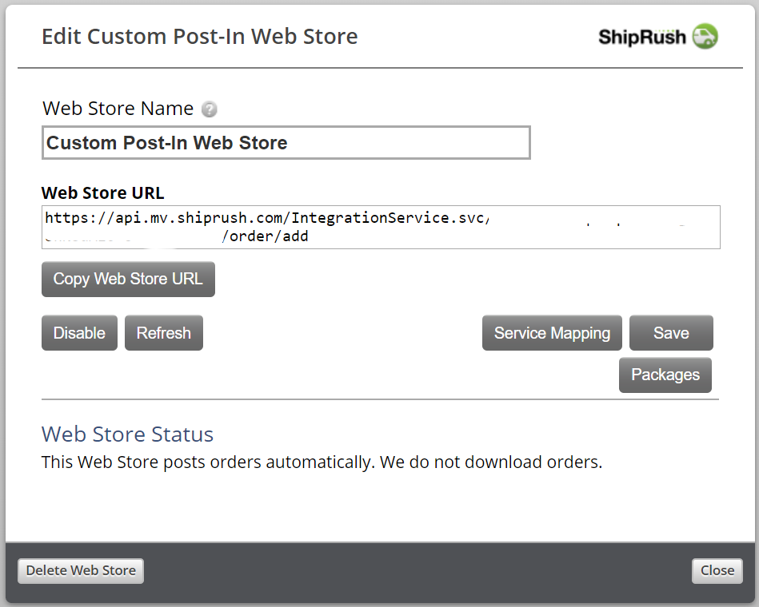

### Setting the Azure Function configuration
- Now let's take the Urls and API Keys we collected and put them in the Azure Function so it can start working. So go back to your Function App and click "Application Settings"
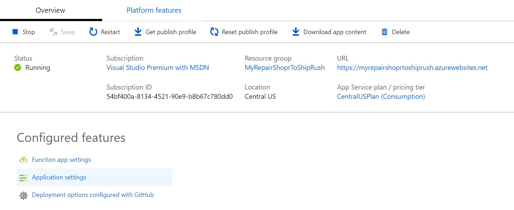
- Click the "New Application Setting" button to add your settings one by one.
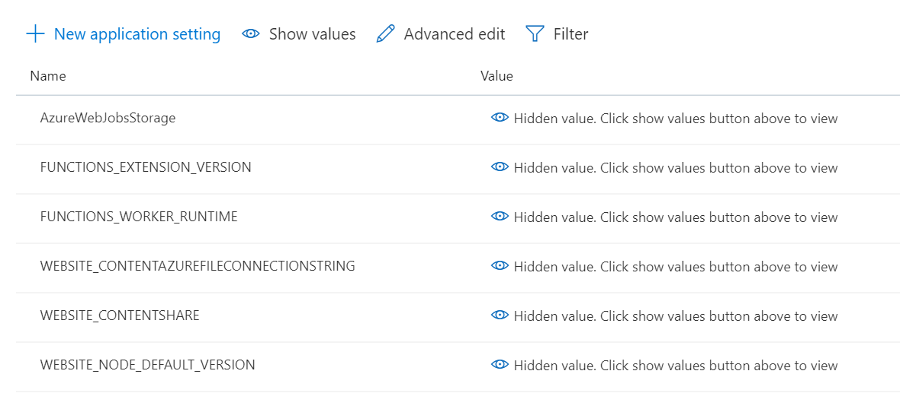
- The table below shows all the values needed for configuration, you should have all the values from the previous steps. This is the kind of thing where an extra space or capitalization would break things, so be carefull. Don't forget to change the items in bold to match your tenants.

| Name | Value |
| --- | --- |
| repairShoprUri | **API Url from RepairShopr** |
| repairShoprApiKey | **API Key from RepairShopr** |
| shipRushUri | **API Url with Key you got from ShipRush** |
| itemCode | **Search string for line items** |
| testMode | **false** |

**itemCode** allows you to only import invoices which has this search string in any if its line items name. For example, if an invoice contains a line item contain the word "MAIL IN", then the invoice would be processed to ShipRush. Otherwise, it will be ignored. To turn this off and processes all invoices regalrdless of the line items, just leave this field empty.

**testMode** allows you to just test the app if you're unsure of the app's behavior. It allows you to only read values from RepiarShopr without writing anything to ShipRush. I adivse you set this to **true** the first time your run the app and check the logs first
- Don't forget to press "Save" on the "Application Settings" page after you add these values. After I was done this is what it looked like for me.

And that's it, you should be done. To make sure the Function App is working, go back to the Function App's main page, click on the app name from the left menu, and scroll down the page to open the "Logs" pane. You should see something like this.
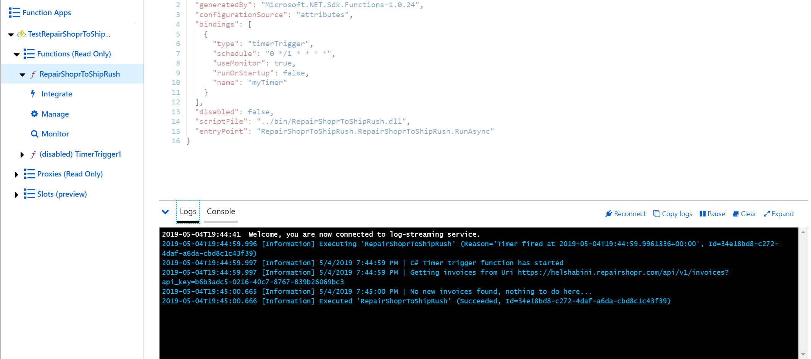
